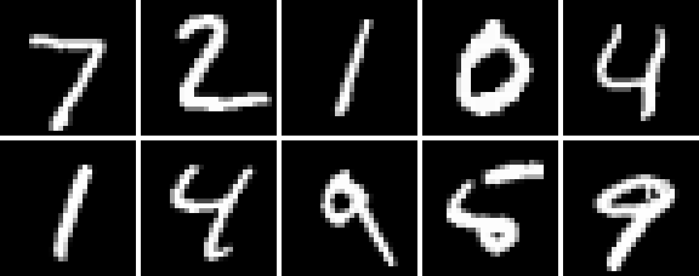

```@meta
CurrentModule = HuggingFaceDatasets
DocTestSetup = quote
    using HuggingFaceDatasets, PythonCall
    using HuggingFaceDatasets: features, class_names, int2str, str2int, Value
    HuggingFaceDatasets.datasets.disable_progress_bars()
end
```

# Guide

This guide covers how the wrapper relates to the underlying Python `datasets` library,
the `"julia"` format and the transform pipeline, array orientation and working with
images, and how to feed a dataset into a Julia data loader — including process-parallel
(`num_workers`) loading that scales past CPython's GIL.

The examples below build small datasets in memory with the [`Dataset`](@ref) constructor
(which accepts a `Dict` or `NamedTuple` of columns) so that they are self-contained and
reproducible. In
practice you will usually obtain a dataset from the Hub with [`load_dataset`](@ref), e.g.
`load_dataset("ylecun/mnist", split="train")`; everything shown here applies equally to
those datasets.

## Loading datasets

[`load_dataset`](@ref) forwards all its arguments to the Python
[`datasets.load_dataset`](https://huggingface.co/docs/datasets/package_reference/loading_methods#datasets.load_dataset)
function. What it returns depends on the `split` argument:

- without `split`, you get a [`DatasetDict`](@ref) (a dictionary of splits), e.g.
  `load_dataset("nyu-mll/glue", "sst2")`;
- with a `split`, you get a single [`Dataset`](@ref), e.g.
  `load_dataset("nyu-mll/glue", "sst2", split="train")`.

A [`DatasetDict`](@ref) is an `AbstractDict{String, Dataset}`, so `keys`, `values`,
`haskey`, `get`, and iteration all work as expected:

```jldoctest guide
julia> train = Dataset((; label=[1, 0, 1, 0]));

julia> test = Dataset((; label=[1, 1]));

julia> dd = DatasetDict("train" => train, "test" => test)
DatasetDict({
    train: Dataset({
        features: ['label'],
        num_rows: 4
    })
    test: Dataset({
        features: ['label'],
        num_rows: 2
    })
})

julia> collect(keys(dd))
2-element Vector{String}:
 "train"
 "test"

julia> dd["train"]
Dataset({
    features: ['label'],
    num_rows: 4
})
```

A [`Dataset`](@ref) supports 1-based indexing, `length`, `firstindex`/`lastindex`
(so `ds[begin]` and `ds[end]` work), and iteration over observations:

```jldoctest guide
julia> ds = Dataset((; label=[5, 0, 4]));

julia> length(ds)
3

julia> ds[begin]
Dict{String, Int64} with 1 entry:
  "label" => 5

julia> ds[end]
Dict{String, Int64} with 1 entry:
  "label" => 4

julia> [obs for obs in ds]      # iteration yields one observation at a time
3-element Vector{Dict{String, Int64}}:
 Dict("label" => 5)
 Dict("label" => 0)
 Dict("label" => 4)
```

Indexing with a single integer returns one observation; indexing with a range or vector
returns a batch, represented as a dictionary mapping each column name to a vector of
values (see below).

## Method forwarding

Any method or property of the wrapped Python object is available directly on the Julia
wrapper. Method calls are forwarded to Python, and their results are converted back with
[`py2jl`](@ref). This means the whole `datasets` API is usable without a dedicated Julia
binding for each method:

```jldoctest guide
julia> ds = Dataset((; label=[0, 1, 2, 3]));

julia> ds.select(0:1)                       # keep the first two rows
Dataset({
    features: ['label'],
    num_rows: 2
})

julia> ds.train_test_split(test_size=0.5, seed=42)
DatasetDict({
    train: Dataset({
        features: ['label'],
        num_rows: 2
    })
    test: Dataset({
        features: ['label'],
        num_rows: 2
    })
})
```

Keyword arguments are forwarded as Python keyword arguments, so calls like
`train_test_split(test_size=0.5)` and `shuffle(seed=0)` behave exactly as in Python.

!!! note "0-based method arguments"
    Methods forwarded to Python keep Python semantics, including **0-based indices**
    (e.g. the argument to `select` above). Only the wrapper's own `getindex`/iteration
    interface is 1-based. Consult the
    [`datasets` documentation](https://huggingface.co/docs/datasets) for the exact
    meaning of each method's arguments.

## Inspecting the schema: features and labels

Every dataset carries a **schema** describing each column's type. `ds.features` returns it as
a [`Features`](@ref) view — an `AbstractDict` from column name to feature type — so you can
inspect dtypes and, crucially, decode integer class labels. Indexing a column yields its
feature: a [`Value`](@ref) for a scalar column (carrying an Arrow `dtype`), a
[`ClassLabel`](@ref) for an encoded label, and so on.

```jldoctest guide
julia> ds = Dataset((; text=["good", "bad", "good"], label=["pos", "neg", "pos"]));

julia> ds.features
{'text': Value('string'), 'label': Value('string')}

julia> ds.features["text"]
Value('string')
```

The most useful leaf is [`ClassLabel`](@ref), which maps integer class ids to names. Turn a
string column into one with the forwarded `class_encode_column`, then read the mapping straight
off the feature with Pythonic method chaining (`.names`, `.int2str`, `.str2int`):

```jldoctest guide
julia> ds = Dataset((; label=["pos", "neg", "pos"]));

julia> ds = ds.class_encode_column("label");   # string column -> ClassLabel (names sorted)

julia> cl = ds.features["label"]
ClassLabel(names=['neg', 'pos'])

julia> cl.names
2-element Vector{String}:
 "neg"
 "pos"

julia> cl.int2str(0)            # 0-based class id -> name (no index offset)
"neg"

julia> cl.str2int("pos")
1

julia> ds["label"]              # the stored ids are 0-based data, not 1-based indices
3-element HuggingFaceDatasets.Column{Int64}:
 1
 0
 1
```

!!! note "Class ids are 0-based data"
    A `ClassLabel` column stores **0-based class ids** (`ds["label"]` above is `[1, 0, 1]`),
    not 1-based Julia indices. `int2str`/`str2int` pass ids through to Python unchanged; only
    the wrapper's `getindex`/iteration interface is 1-based. Decoding a whole column is
    therefore `cl.names[ds["label"] .+ 1]`, where the `+1` bridges a 0-based id to a 1-based
    Julia position.

For the common "from a dataset and column name" case there are also public (unexported) Julian
shortcuts — [`class_names`](@ref), [`int2str`](@ref), and [`str2int`](@ref) — that look up the
column's `ClassLabel` for you (and error clearly if it isn't one):

```jldoctest guide
julia> ds = Dataset((; label=["pos", "neg", "pos"]));

julia> ds = ds.class_encode_column("label");

julia> class_names(ds, "label")
2-element Vector{String}:
 "neg"
 "pos"

julia> int2str(ds, "label", [0, 1, 1])   # decode a batch of ids in one call
3-element Vector{String}:
 "neg"
 "pos"
 "pos"
```

Reach these as `HuggingFaceDatasets.class_names` etc., or bring them into scope with
`using HuggingFaceDatasets: class_names, int2str, str2int`. To **construct** a schema from
Julia — e.g. to pass as a `features=` argument — build the wrapper types (also public but
unexported: `HuggingFaceDatasets.ClassLabel(names=["neg", "pos"])`,
`HuggingFaceDatasets.Value("int64")`) and hand them back to Python with [`jl2py`](@ref).

## The `"julia"` format and transforms

Datasets are returned in the `"julia"` format by default, so indexing yields native Julia
values. This format mirrors `datasets`' own `set_format`/`with_format` mechanism and adds
an extra Julia-side transform.

### Setting a format

[`with_format`](@ref) returns a copy of the dataset with a given format;
[`set_format!`](@ref) mutates it in place; [`reset_format!`](@ref) restores the default
`"julia"` format. Passing `nothing` strips all formatting and hands back raw Python.

```jldoctest guide
julia> ds = Dataset((; label=[5, 0, 4]));   # "julia" format by default

julia> ds[1]
Dict{String, Int64} with 1 entry:
  "label" => 5

julia> ds[1:3]                          # a batch: each column becomes a vector
Dict{String, Vector{Int64}} with 1 entry:
  "label" => [5, 0, 4]

julia> ds["label"]                      # a whole column: a lazy `Column` view
3-element HuggingFaceDatasets.Column{Int64}:
 5
 0
 4

julia> set_format!(ds, nothing);        # strip formatting: raw Python observations

julia> ds[1]
Python: {'label': 5}
```

Indexing by column name returns a lazy [`Column`](@ref): it behaves like a vector
(indexing, slicing, iteration, broadcasting) but converts elements only on access, so
the whole column is never materialized at once. Call `collect` to get a plain `Vector`.

The special `"julia"` format is backed by `datasets`' `numpy` format and sets the Julia
transform to [`py2jl`](@ref), which recursively converts Python containers (lists, tuples,
dicts, sets) and numpy arrays into native Julia values, copylessly when possible. Because
the numpy format decodes array and image cells to numeric arrays, an image column comes
back as a raw array rather than a colorview (see [Working with images](@ref)). Any other
format string (e.g. `"numpy"`, `"torch"`, `"pandas"`) is forwarded to the underlying
Python `set_format`, and `nothing` clears the format entirely.

### Custom Julia transforms

Beyond the format, you can attach an arbitrary Julia function that runs when indexing,
with [`with_jltransform`](@ref) / [`set_jltransform!`](@ref). The transform receives the
raw Python batch, so convert it with [`py2jl`](@ref) first if you want to work with Julia
types:

```jldoctest guide
julia> ds = Dataset((; x=[1, 2, 3]));

julia> ds = with_jltransform(ds) do batch
           b = py2jl(batch)          # convert the Python batch to Julia types first
           b["x"] .* 10
       end;

julia> ds[1]
10

julia> ds[1:3]
3-element Vector{Int64}:
 10
 20
 30
```

The transform is **always applied to a batch**, even for a single-integer index: `ds[1]`
is treated as `ds[1:1]` from the transform's point of view, and the single observation is
then extracted.

Note that the format and the custom transform share the same slot: setting the `"julia"`
format installs `py2jl` as the transform, and `with_jltransform` then replaces it — which
is why the transform above calls `py2jl` itself. For layering additional per-batch
processing on top of the `"julia"` format, prefer `MLUtils.mapobs` (see below), as in the
[`perf/flux_mnist/flux_mnist.jl`](https://github.com/JuliaGenAI/HuggingFaceDatasets.jl/blob/main/perf/flux_mnist/flux_mnist.jl)
script.

The order of operations when you index is:

1. the Python format transform (if any) is applied by `datasets`;
2. the Julia transform runs on the resulting Python batch (for the `"julia"` format this
   is [`py2jl`](@ref); otherwise your own function);
3. for single-integer indexing, one observation is extracted from the batch.

`with_format`/`with_jltransform` return a shallow copy that shares the underlying Arrow
data with the original but has an independent format, so setting a format or transform on
the copy does not affect the original.

## Transforming with `map` and `filter`

`map` and `filter` are the core `datasets` verbs for building a new dataset from an
existing one. The overloads [`map(f, ds)`](@ref) / [`filter(f, ds)`](@ref) bridge the
callback for you: each example (or batch, with `batched=true`) is converted with
[`py2jl`](@ref) before `f` sees it, and `f`'s Julia return value is converted back to
Python with [`jl2py`](@ref) (the write-path dual of `py2jl`). You can therefore write a
pure-Julia transform while still getting `datasets`' batching, caching, and
multiprocessing:

```julia-repl
julia> ds = Dataset((; label=[5, 0, 4]));

julia> ds2 = map(x -> Dict("label" => x["label"] .+ 100), ds; batched=true);

julia> ds2[1:3]["label"]
3-element Vector{Int64}:
 105
 100
 104

julia> ds3 = filter(x -> x["label"] > 2, ds);   # keep rows with label > 2

julia> ds3[:]["label"]
2-element Vector{Int64}:
 5
 4
```

The property-style calls `ds.map(f)` / `ds.filter(f)` are **equivalent** to `map(f, ds)` /
`filter(f, ds)` — they route to these same overloads, so the callback still sees Julia values.
A [`DatasetDict`](@ref) behaves the same way: `map(f, dd)` / `dd.map(f)` and `filter(f, dd)` /
`dd.filter(f)` apply `f` per example across every split (note this makes `filter(f, dd)` filter
*examples*, not split entries).

A few things to note:

- **Batched or not.** Without `batched=true` the callback sees one example at a time (a
  `Dict` of scalar values, or whatever `py2jl` returns); with `batched=true` it sees a
  batch (a `Dict` mapping each column to a vector). Return the same shape: a scalar
  (`map`) / `Bool` (`filter`) per example, or a vector per column / `Vector{Bool}` when
  batched.
- **Keyword arguments** such as `batched`, `num_proc`, and `remove_columns` are forwarded
  to the Python method, so multiprocessing and caching work as usual.
- **Format is preserved.** The returned `Dataset` inherits the parent's `"julia"` format
  (or any custom `jltransform`), so `ds2` above is still `"julia"`-formatted and a chained
  pipeline like `map(f, dsj) |> ...` keeps returning Julia values.
- **Raw Python callbacks.** To hand `map`/`filter` a callback written in "PythonCall
  dialect" (receiving raw `Py` rows/batches, `pyconvert` in, `pylist`/`pydict` out), reach
  for the underlying Python method with `ds.py.map(...)` / `ds.py.filter(...)`:

  ```julia-repl
  julia> ds.py.map(x -> pydict(label=pylist([pyconvert(Int, l) + 100 for l in x["label"]])),
                   batched=true);      # written against the Python API
  ```

## Array orientation

!!! warning "Arrays come back transposed"
    numpy is **row-major**, Julia is **column-major**. The zero-copy conversion
    ([`numpy2jl`](@ref)) therefore returns an array whose **dimensions are
    reversed** relative to the Python side: a numpy array of shape `(d₁, …, dₙ)` becomes a
    Julia array of size `(dₙ, …, d₁)`.

Under the `"julia"` format (backed by `datasets`' `numpy` format) an array-valued column
decodes to a **real N-D numeric array** rather than a nested `Vector{Vector}`, and a range
index **stacks** the rows along the last axis into a `(dims…, N)` tensor — observation axis
last, matching the MLUtils convention:

```jldoctest guide
julia> ds = Dataset((; x = [[1 2 3; 4 5 6], [7 8 9; 10 11 12]]));

julia> ds[1]["x"]                     # one observation: a real 2×3 matrix
2×3 Matrix{Int64}:
 1  2  3
 4  5  6

julia> ds[1:2]["x"]                   # a batch stacks along the last axis
2×3×2 Array{Int64, 3}:
[:, :, 1] =
 1  2  3
 4  5  6

[:, :, 2] =
  7   8   9
 10  11  12
```

To recover the Python orientation of a single array, reverse the axes with `permutedims`:

```jldoctest guide
julia> a = numpy2jl(jl2numpy([1 2 3; 4 5 6]));   # a Julia array, transposed vs. numpy

julia> size(a)
(2, 3)

julia> size(permutedims(a, reverse(1:ndims(a))))
(3, 2)
```

The reverse conversion [`jl2numpy`](@ref) is symmetric: it shares memory through the
buffer protocol and reverses the axes, so `numpy2jl(jl2numpy(x)) == x` holds and writes
propagate in both directions.

## Working with images

An `Image` feature (`datasets.Image`) is decoded to a numeric array by the `numpy` format
*before* [`py2jl`](@ref) sees it, so under the `"julia"` format an image column is a **raw
numeric array**, not an `ImageCore` colorview. Combined with the axis reversal above:

- a grayscale `(H, W)` image becomes a `(W, H)` `UInt8` matrix;
- a color `(H, W, C)` image becomes a `(C, W, H)` `UInt8` array (channel axis first);
- a fixed-size image column **stacks** on a range index (to `(W, H, N)` / `(C, W, H, N)`),
  while a ragged (variable-size) column falls back to a `Vector` of per-row arrays.

That raw layout is what you want for feeding a model (see
[Data Loaders](@ref) and the MNIST example), but to *look* at
an image you turn it back into a colorview and undo the transpose with `permutedims`. Two
small helpers cover the common cases:

```julia
using HuggingFaceDatasets, ImageCore

# grayscale: (W, H) UInt8  ->  (H, W) Matrix{Gray{N0f8}}
to_gray(a) = permutedims(colorview(Gray, reinterpret(N0f8, a)))

# color: (C, W, H) UInt8   ->  (H, W) Matrix{RGB{N0f8}}
to_rgb(a)  = permutedims(colorview(RGB,  reinterpret(N0f8, a)))
```

`reinterpret(N0f8, a)` reads the raw `UInt8` bytes as normalized `[0, 1]` fixed-point
values (no copy), `colorview` wraps the leading axis into `Gray`/`RGB` pixels, and
`permutedims` swaps the spatial axes back to the original `(H, W)` orientation. Rendering
the first ten MNIST test digits as a mosaic:

```julia-repl
julia> using HuggingFaceDatasets, ImageCore, MosaicViews

julia> ds = load_dataset("ylecun/mnist", split="test");   # "julia" format by default

julia> digits = [to_gray(ds[i]["image"]) for i in 1:10];

julia> mosaicview(cat(digits...; dims=3); nrow=2, npad=1, fillvalue=Gray(1), rowmajor=true)
```



In VS Code, a Pluto/Jupyter notebook, or any `ImageInTerminal`-enabled REPL such an image
renders inline. To write it to disk, add [FileIO](https://github.com/JuliaIO/FileIO.jl)
(with a backend such as `ImageIO`) and `save` it:

```julia-repl
julia> using FileIO

julia> save("digit.png", to_gray(ds[1]["image"]))
```

The same `to_rgb` helper handles color datasets (e.g. `to_rgb(ds[1]["img"])` on CIFAR-10),
and it round-trips exactly: the recovered array is pixel-for-pixel identical to the image
`datasets` decodes on the Python side.

## Integration with MLUtils

A [`Dataset`](@ref) implements the length/`getindex` interface expected by
[MLUtils.jl](https://github.com/JuliaML/MLUtils.jl), so `numobs`, `getobs`, and `mapobs`
work directly:

```jldoctest guide
julia> using MLUtils

julia> ds = Dataset((; x=[1, 2, 3, 4]));

julia> numobs(ds)
4

julia> getobs(ds, 2)
Dict{String, Int64} with 1 entry:
  "x" => 2

julia> mapped = mapobs(batch -> batch["x"] .* 10, ds);   # lazily transform observations

julia> getobs(mapped, 1:4)
4-element Vector{Int64}:
 10
 20
 30
 40
```

Because of this, a `Dataset` can be handed straight to a data loader — see below.

## Data Loaders

A [`Dataset`](@ref) is a valid MLUtils data container, so you can hand one straight to
`MLUtils.DataLoader` (re-exported by Flux as `Flux.DataLoader`), including through a
`mapobs`/`ObsView` transform. The loader's own options are covered in the
[MLUtils Data Loaders guide](https://juliaml.github.io/MLUtils.jl/stable/guide/iteration/);
the notes below are specific to a `Dataset`.

### Iterating batches

Each batch is the dataset's own `"julia"`-format batch: the columns for the batch's rows,
stacked and keyed by name (numeric array columns stack into an N-D array with the
observation axis last). Small, self-contained example:

```jldoctest guide
julia> loader = DataLoader(Dataset((; x=1:6, y=10:10:60)); batchsize=2);

julia> batch = first(loader);

julia> batch["x"], batch["y"]
([1, 2], [10, 20])
```

Most training loops want `(input, target)` pairs rather than a `Dict`, so wrap the dataset
in a `mapobs` that reshapes each observation; the loader then collates the tuples
column-wise into an `(inputs, targets)` batch you can destructure with `for (x, y) in
loader`:

```jldoctest guide
julia> reshape_obs(o) = (o["x"] * 100, o["y"]);   # per-observation: Dict -> (input, target)

julia> loader = DataLoader(mapobs(reshape_obs, Dataset((; x=1:6, y=10:10:60))); batchsize=2);

julia> first(loader)
([100, 200], [10, 20])
```

Against the Hub, the same shapes hold — swap the in-memory `Dataset` for a `load_dataset`:

```julia-repl
julia> using MLUtils

julia> ds = load_dataset("ylecun/mnist", split="train");   # "julia" format by default

julia> loader = DataLoader(ds; batchsize=128, shuffle=true);

julia> batch = first(loader);   # batch["image"] is (28, 28, 128), batch["label"] is length-128
```

### Materializing vs. reading on the fly

For small datasets you can **materialize** into memory up front with `[:]` (faster per
epoch, no decoding during iteration); otherwise the loader reads **on the fly**, keeping
memory flat:

```julia-repl
julia> materialized = DataLoader(ds[:]; batchsize=128, shuffle=true);   # whole dataset in RAM

julia> on_the_fly  = DataLoader(ds; batchsize=128, shuffle=true);       # decode per batch
```

Layer a per-batch transform with `mapobs`; with `[:]` on the *mapped* dataset the transform
runs once up front, without it the transform runs per batch during iteration:

```julia-repl
julia> mnist_transform(o) = (Float32.(o["image"]) ./ 255, o["label"]);

julia> train = mapobs(mnist_transform, ds);

julia> loader = DataLoader(train[:]; batchsize=128, shuffle=true);   # or drop [:] for on-the-fly
```

### Parallel loading (`num_workers`)

Reading on the fly calls into CPython, and CPython's global interpreter lock (**GIL**)
serializes those reads, so thread-based `parallel=true` gives ~1× on a `Dataset`. Use
`num_workers=N` instead (needs MLUtils ≥ 0.4.11): it spreads `getobs` over `N` worker
**processes**, each with its own interpreter and GIL, so loading scales past the GIL:

```julia-repl
julia> loader = DataLoader(ds; batchsize=128, num_workers=4);   # 4 worker processes

julia> for batch in loader
           # ... training step ...
       end
```

This works because a `Dataset` serializes by *reference* to its on-disk Arrow files
(an in-memory dataset is first materialized to a temporary Arrow file, announced with an
`@info`), so if you set a `jltransform` it must be serializable. It composes with a
`mapobs`/`ObsView` wrapper at any nesting — `DataLoader(mapobs(f, ds); num_workers=4)` runs
`f` on the workers. Batches may arrive **out of input order** across workers; combine with
`shuffle=true` (or don't rely on order). Worker processes are launched on demand under the
current `--project`; call `MLUtils.close_dataloader_pool()` to tear them down. Process
parallelism only pays off when `getobs` is the bottleneck (large images, heavy decode) —
for cheap observations the IPC overhead can make it slower than serial. See the MLUtils
guide for the mechanics and tradeoffs.

A complete example — `mapobs` transform, `num_workers`, and a training loop, benchmarked
against PyTorch — lives in
[`perf/flux_mnist/`](https://github.com/JuliaGenAI/HuggingFaceDatasets.jl/tree/main/perf/flux_mnist).
